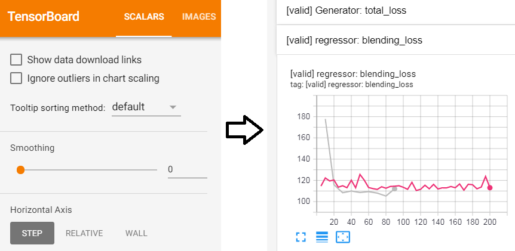
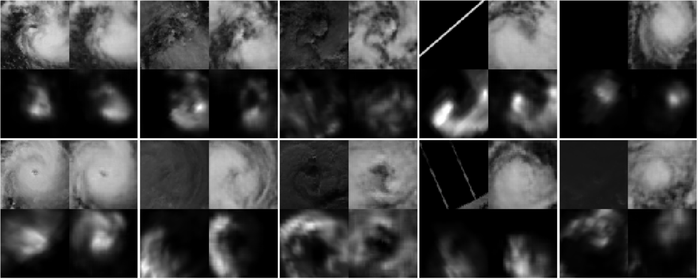
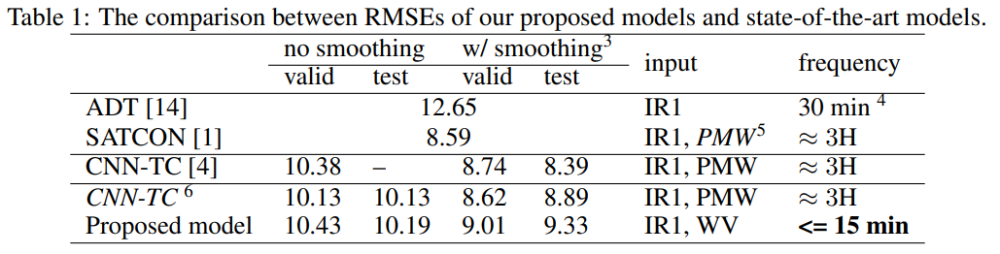
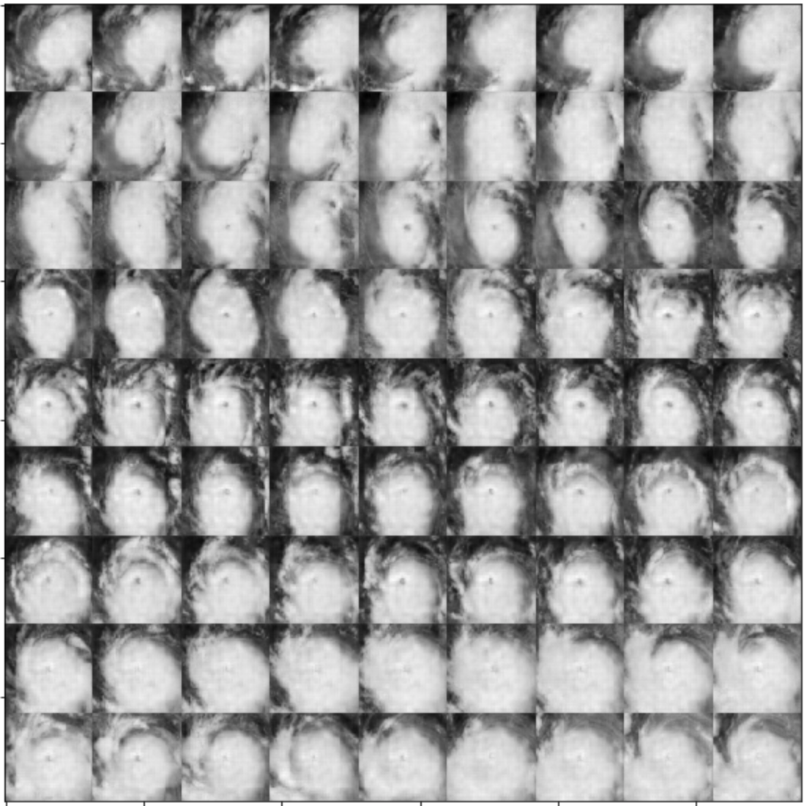
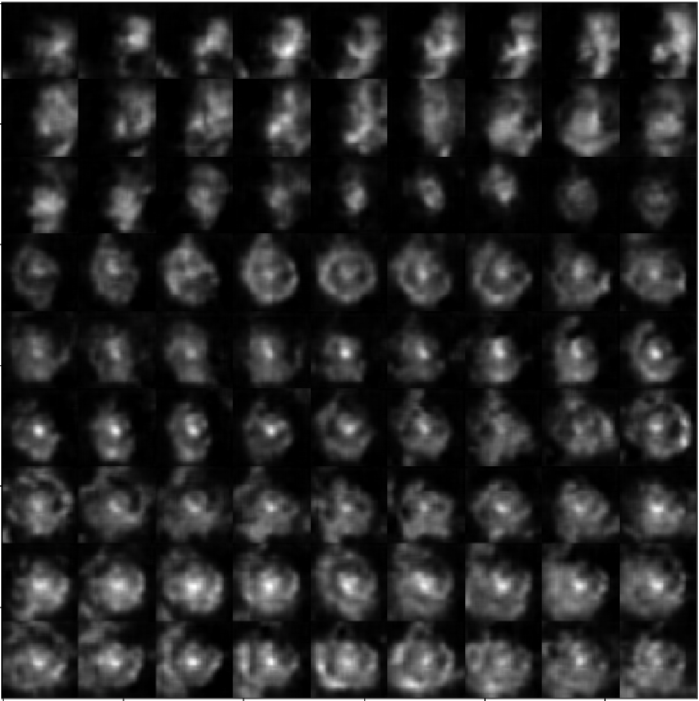

# Real-time Tropical Cyclone Intensity Estimation by Handling Temporally Heterogeneous Satellite Data

This repository is the official implementation of Real-time Tropical Cyclone Intensity Estimation by Handling Temporally Heterogeneous Satellite Data. 


## Requirements

To install requirements:

0. install pipenv (if you don't have it installed yet)
```setup
pip install pipenv
```
1. use pipenv to install dependencies:
```
pipenv install
```
2. install tensorflow **in the** pipenv shell
(choose compatible tensorflow version according to your cuda/cudnn version)
```
pipenv run pip install tensorflow
pipenv run pip install tensorflow_addons
```

## Training

To run the experiments in the paper, run this command:

```train
pipenv run python main.py train <experiment_path>

<experiment_path>:
experiments/GAN_experiments/three_stage_training.yml: The elementary version of the proposed model.
experiments/GAN_experiments/five_stage_training.yml: To reproduced the result list in the paper, use this.
experiments/GAN_experiments/five_stage_training_bug_fixed.yml: Fixed a bug in the paper_reproduction version, generate VIS images better during the night.

experiments/regressor_experiments/reproduce_CNN-TC.yml: The reproduction of the former work.
experiments/regressor_experiments/channel_composition_Vmax.yml: To obtain the Fig.7 in the paper.
```

**Running the whole five_stage_training experiment takes about 20~25 hours on my GTX 1080 gpu.**

Training process is accelarted to about 8 hours in our next work. However, it's not included in this paper.

***Notice that on the very first execution, it will download and extract the dataset before saving it into a folder "TCIR_data/".
This demands approximately 80GB space on disk as well as about 20 min preprocessing time, please be patient. :D***

### Some usful aguments

#### To limit GPU usage
Add *GPU_limit* argument, for example:
```args
pipenv run python train main.py <experiment_path> --GPU_limit 3000
```

#### Continue from previous progress
An experiemnt is divided into several sub_exp's.
For example, a *five_stage_training* experiment comprise 5 sub-exp's.

Once the experiemnt get interrupted, we probably want to continue from the completed part.
For example, when the *five_stage_training* experiment get interrupted when executing sub-exp #3 (*pretrain_regressor_all_data_stage*), we want to restart from the beginning of sub-exp #3 instead of sub-exp #1.

We can do this to save times:

1. Remove partially done experiment's log.
```
rm -r logs/five_stage_training/pretrain_regressor_all_data_stage/ 
```

2. Restart experiment with argument: *omit_completed_sub_exp*.
```
pipenv run python train main.py experiments/GAN_experiments/five_stage_training.yml --omit_completed_sub_exp
```

## Evaluation

All the experiments are evaluated automaticly by tensorboard and recorded in the folder "logs".
To check the result:

```eval
pipenv run tensorboard --logdir logs

# If you're running this on somewhat like a workstation, you could bind port like this:
pipenv run tensorboard --logdir logs --port=1234 --bind_all
```

Curve described in fig.7 of the paper can be obtained from the **[valid] regressor: blending_loss** in the scalar tab.


To calculate test scores:
```test_score
pipenv run python main.py evaluate <experiment_path>
```

## Results

### Generated_examples



Our model achieves the following performance on:
### [TCIR](https://github.com/BoyoChen/TCIR)



### Continuous, stable, high frequency observations:

With the proposed model, we can now:

1. Stably obtain VIS images even at the midnight.
2. Stably obtain PMW up to every 15 minutes.

Here we show an example, this is Hurricane Dorian (2019).

We generate simulated VIS/PMW by our proposed model once per hour.

The first image starts from 08/30 2019 0000 UTC.

The last image ends at 09/02 2019 0800 UTC.

#### VIS



The figure shows the ability of proposed model to generate decent simulated VIS observation even at the midnight.

### PMW:



Notice that PMW obervations can only be obtained once per 3 hours before.
With our proposed method, simulated PMW observations can be obtained with in much better frequency.