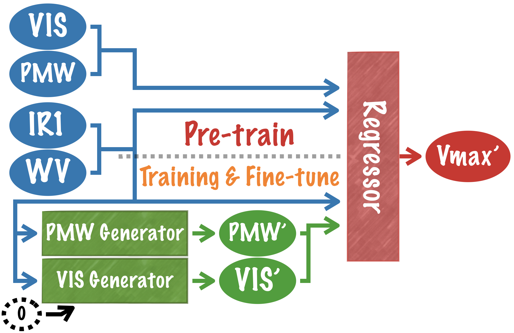

# Real-time Tropical Cyclone Intensity Estimation by Handling Temporally Heterogeneous Satellite Data

This repository is the official implementation of Real-time Tropical Cyclone Intensity Estimation by Handling Temporally Heterogeneous Satellite Data. 

 

## Requirements

To install requirements:

```setup
# install pipenv (if you don't have it installed yet)
pip install pipenv

# use pipenv
pipenv install

# install tensorflow **in the** pipenv shell, (choose compatible tensorflow version according to your cuda/cudnn version)
pipenv run pip install tesorflow
```

## Training

To run the experiments in the paper, run this command:

```train
pipenv run python main.py <experiment_path> train

# To limit GPU usage, add an argument:
pipenv run python main.py <experiment_path> train --GPU_limit 3000

<experiment_path>:
experiments/GAN_experiments/five_stage_training.yml: The proposed model.
experiments/GAN_experiments/three_stage_training.yml: The elementary version of the proposed model.

experiments/regressor_experiments/reproduce_CNN-TC.yml: The reproduction of the formar work.
experiments/regressor_experiments/channel_composition_Vmax.yml: To obtain the Fig.7 in the paper.
```

***Notice that on the very first execution, it will download and extract the dataset before saving it into a folder "TCIR_data/".
This demands approximately 80GB space on disk. :)***

## Evaluation

All the experiment is evaluated automaticly by tensorboard and recorded in the folder "logs".
To check the result:

```eval
pipenv run tensorboard --logdir logs

# If you're running this on somewhat like a work station, bind port by arguments:
pipenv run tensorboard --logdir logs --port=6090 --bind_all
```

## Pre-trained Models

You can download pretrained models here:

- [My awesome model](https://drive.google.com/mymodel.pth) trained on ImageNet using parameters x,y,z. 

> 📋Give a link to where/how the pretrained models can be downloaded and how they were trained (if applicable).  Alternatively you can have an additional column in your results table with a link to the models.

## Results

Our model achieves the following performance on :

### [Image Classification on ImageNet](https://paperswithcode.com/sota/image-classification-on-imagenet)

| Model name         | Top 1 Accuracy  | Top 5 Accuracy |
| ------------------ |---------------- | -------------- |
| My awesome model   |     85%         |      95%       |

> 📋Include a table of results from your paper, and link back to the leaderboard for clarity and context. If your main result is a figure, include that figure and link to the command or notebook to reproduce it. 


## Contributing

> 📋Pick a licence and describe how to contribute to your code repository. 